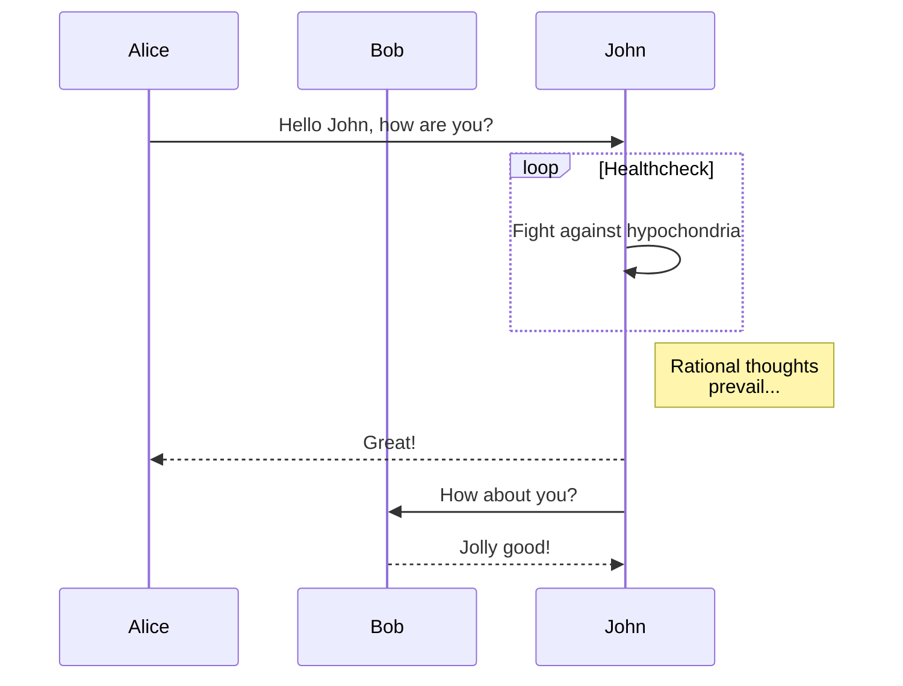
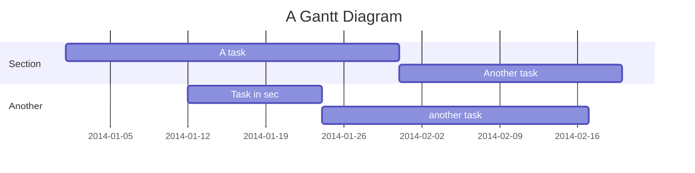

测试hexo插件效果，之后删除。

## 测试hexo插件

- hexo-filter-mermaid-diagrams
- hexo-filter-flowchart
- hexo-filter-mermaid-diagram
 
### 测试flowchart
<!-- more -->

```js
const str = "测试普通pre标签是否失效";
console.log(str);
```


```flow
st=>start: Start|past:>http://www.google.com[blank]
e=>end: End:>http://www.google.com
op1=>operation: My Operation|past
op2=>operation: Stuff|current
sub1=>subroutine: My Subroutine|invalid
cond=>condition: Yes
or No?|approved:>http://www.google.com
c2=>condition: Good idea|rejected
io=>inputoutput: catch something...|request

st->op1(right)->cond
cond(yes, right)->c2
cond(no)->sub1(left)->op1
c2(yes)->io->e
c2(no)->op2->e
```

### 测试mermaid





